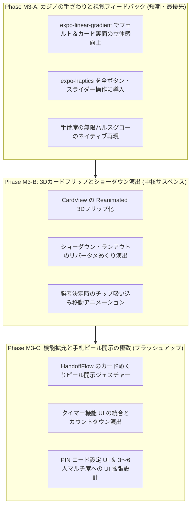

# Pass & Play Poker — ポーカー体験（UX・演出・グラフィック）改善提案書

## 0. 本ドキュメントの位置づけと背景

### 現状認識と課題
- Web版 v0.1 および Expo モバイル版（`apps/mobile`）の骨組み（Phase M2: 全画面の 1:1 静的移植）は完成しました。
- しかし、特にモバイルアプリ側では「ロジックと画面骨組みを動かすこと」を最優先とし、アニメーション・質感・触覚フィードバックを意図的に未実装（またはシンプルな設定）としています。
- その結果、骨組みとしては正しく動作するものの、**「ポーカーアプリとして触っていてあまり気持ちよくない・臨場感やサスペンス感が足りず、開発の進行がしっくりこない」** という根本的な課題が生じています。

### 本作（Pass & Play Poker）特有の UX の核心
一般的なオンライン対戦ポーカーは「自分の手札が画面の隅に常に表示され、相手のアバターとオンラインでやり取りする」構造です。
一方、本作は **「1台のスマホを対面（飲み会や旅行など）で手渡ししながら遊ぶオフラインポーカー」** です。

そのため、本作における最高のポーカー体験とは、単に一般的なアプリの UI を真似ることではなく、
**「手渡し（Pass）」「秘密の開示（Peel & Reveal）」「心理戦とアクション（Action）」「ショーダウンのめくり（Showdown）」** という 4 大シーンにおいて、物理的な手ざわりと劇的な演出を提供することにあります。

---

## 1. シーン別：体験改善の具体策（何を変えるとどう良くなるか）

### シーン①：端末の手渡し（Pass）と待機（Idle / Locked）

> [!IMPORTANT]
> 手渡し中は「相手に手札やテーブルの状況を覗き見されないこと」「次に誰の番かが一目で分かること」「手渡し完了時の明確なフィードバック」が求められます。

#### 1. パス専用トランジション（Pass Screen）の洗練
- **現状**: テーブル画面下部に「〇〇さんに渡してください」というバーとボタンが出るだけで、視線誘導や手渡しの儀式感が薄い。
- **改善策**:
  - 次のターゲットプレイヤーの名前とアバターアイコンを画面中央に大きく表示し、背景をディープな色合いの落ち着いたウェーブや幾何学模様アニメーションにして「手渡し待機・遮蔽モード」であることを明確にする。
  - 相手がスマホを受け取り、**「受け取りました」ボタンを押した瞬間に、カチッという重厚なクリック振動（`expo-haptics` の Medium/Heavy Impact）を返す** ことで、確実なバトンタッチ感を演出する。

---

### シーン②：手札の秘密開示（Peel & Swipe Reveal）

> [!TIP]
> 自分の手札をこっそり確認する瞬間は、ポーカーにおいて最もワクワクするアドレナリンが出るポイントです。

#### 1. カードピール（Card Peeling / めくり）ジェスチャー＆3Dフリップ
- **現状**: 標準的なスライダーを右まで動かすと、カードがパッと静的に表示されるだけ。
- **改善策**:
  - `react-native-reanimated` を活用し、指でスライダーを動かす（または裏向きのカードに触れてスワイプする）量に連動して、**カードの角や裏面が少しずつ 3D でめくれて表が見えてくる（ピールエフェクト）** を実装する。
  - スワイプしている最中に、金庫のダイヤルを回すような **チリリリ…という細かいマイクロハプティクス（`SelectionAsync`）** を鳴らし、カードが開く直前の緊張感を高める。

#### 2. 覗き見シールド（オプション）
- 周囲に友人が座っている状況でも安心して確認できるよう、画面全体は暗い状態で「指で押さえている部分やカードのランク/スートだけがハイライトされる」プライバシー保護モードを用意する。

---

### シーン③：ベッティングと手番アクション（Action & Table Screen）

> [!NOTE]
> 自分の番でチップを賭けるアクションは「カジノのチップを触る物理的な手ざわり」を再現することで、圧倒的な心地よさが生まれます。

#### 1. 手番の明確なスポットライトと呼吸グロー
- 手番プレイヤーの席（Seat）の枠線・背景を `Reanimated` によってゴールドに優しく呼吸発光（パルス）させ、現在誰のターンなのかを直感的に視線誘導する。

#### 2. カジノチップの手ざわりと飛翔アニメーション
- **スライダー操作の触覚**: ベット額スライダーを動かすたびに、**カリカリカリッというカジノチップを触る感覚の連動ハプティクス** を発動させる。
- **チップの飛翔スタック**: ベット／レイズ／コールを確定（タップ＋重い振動）した瞬間、プレイヤー席からテーブル中央のポットに向かって **チップトークンがシュッと飛んでいき、中央のポットに積み重なる（スタックされる）アニメーション** を実装する。
- **オールインのドラマチック演出**: 「ALL IN」を選択した際は、画面周縁が一瞬発光し、特別な重いバイブレーションとともに、全チップが中央へ押し出される劇的なフィードバックを与える。

---

### シーン④：ショーダウン＆ランアウト（Showdown & Runout）

> [!IMPORTANT]
> 全員オールインや勝負の結末を迎えたとき、「リバーの最後の1枚に運命を賭ける」演出がポーカーの最大のクライマックスです。

#### 1. ストリートごとの時間差 3D フリップと「リバーのタメ」
- **現状**: `setTimeout` で一定間隔でパッ、パッとカードが出現するだけで、カードが裏返るアニメーションがない。
- **改善策**:
  - フロップ3枚がクルクルクルッ！と連続で 3D フリップして開く。
  - ターンがめくれ、最後の勝負決定札である **リバー（5枚目）を開く直前に約 0.5 秒の劇的な「タメ（静寂）」を挟み、そこからゆっくりとドラマチックにカードが 3D フリップして表返る** 演出を行う。

#### 2. ベスト5ハイライトと勝者へのチップ吸い込み（Winner Celebration）
- 勝敗確定時、勝者の役構成に使われたベスト5枚のカードが光り輝き、無関係なカードは暗く沈む（dimmed）。
- テーブル中央のポットチップが、**勝者の席に向かって一気に吸い込まれて飛んでいく獲得アニメーション** を実装する。
- 勝者バナーのポップアップ（`winner-pop`）とともに、歓声のような振動と獲得額フロートを祝祭感たっぷりに表示する。

---

## 2. モバイル版 (`apps/mobile`) 技術スタック・実装方針

上記の演出を Expo (React Native) 上で 60fps / 120fps のなめらかさで実現するため、以下の標準的・高品質なライブラリを組み込みます。

| 目的・体験 | 導入・活用するライブラリ | 具体的な用途・実装内容 |
| :--- | :--- | :--- |
| **カードの 3D フリップ＆滑らかなアニメーション** | **`react-native-reanimated`** (v3/v4) | `useSharedValue` と `useAnimatedStyle`（`rotateY`, `perspective`）を用いたカード裏表の3D回転。ドラッグ進捗に応じた手札開示アニメーションやバウンス演出。 |
| **触覚フィードバック（ハプティクス）** | **`expo-haptics`** | `ImpactFeedbackStyle.Medium`（手渡し・ボタン確定）、`SelectionAsync`（スライダー移動・カードピール）、`Notification` / `Heavy`（ショーダウン勝者決定・オールイン）。 |
| **ポーカールーム調の質感・グラフィック** | **`expo-linear-gradient`** | 単色塗りのフェルトを立体的な緑グラデーションへ変更。カード裏面の格子柄・青グラデーションやゴールドレールの表現。 |
| **滑らかなジェスチャー・タッチ操作** | **`react-native-gesture-handler`** | 手札をドラッグ/スワイプして開示する操作のネイティブレベルのレスポンス化。 |
| **安全な画面遮蔽とセキュリティガード** | **`expo-screen-capture`** + `AppState` | （対応済み・継続）バックグラウンド時のサムネイル遮蔽、スクショ禁止ガードの維持。 |

---

## 3. 段階的な実装ロードマップ（優先順位）

すべての演出を一度に実装しようとすると複雑化するため、**対面で遊んだときの「気持ちよさ・ポーカーらしさ」に直結する効果が高いものから 3 段階で実装・リリース** することを提案します。

### 🎯 次のステップへの推奨アクション
まずは **Phase M3-A（`expo-linear-gradient` による質感向上 ＋ `expo-haptics` による全編触覚フィードバック ＋ 手番グロー）** に着手し、現在のモバイルアプリが一気に「カジノのポーカーアプリらしい心地よい手ざわり」に変わることを実感していただくのが最も効果的です。

### 計画メモ(2026-07-19)
- **M3-A / M3-B は実装済み。**
- **M3-C（ピール開示・タイマーUI・PIN設定UI）はユーザー判断により実装しない。** 上記ロードマップ図の M3-C は提案時点の候補であり、現行スコープ外。
- 以降の主線は **実機評価 → フィードバック反映 → 任意の素材/安定化**。
